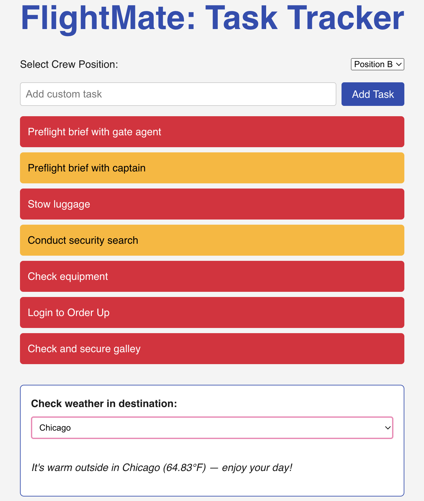
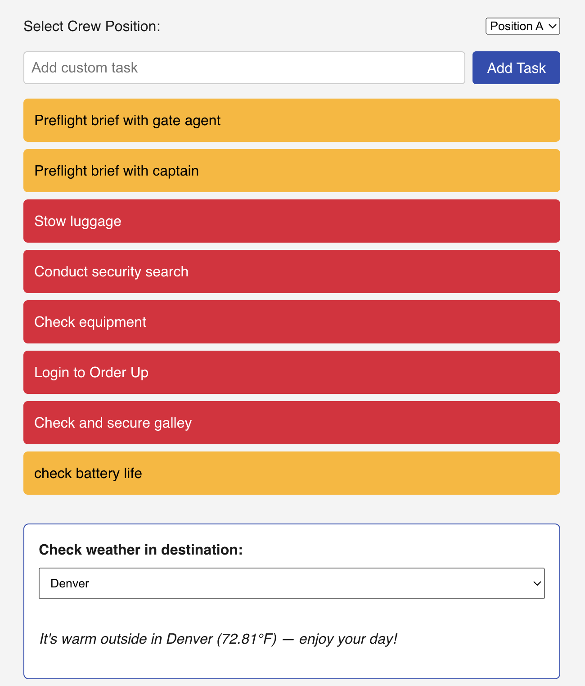

# ✈️ Flightmate – Flight Attendant Task Tracker

Flightmate is a responsive task-tracking application designed for flight attendants to stay organized before flights. It includes a checklist of standard preflight duties for crew positions A–D, the ability to add custom tasks, and live destination weather updates for better preparation.

---

## 🚀 Features

- ✅ Preloaded task list for crew positions A–D (e.g., briefings, security, galley checks)
- ➕ Add custom tasks
- 🔁 Toggle tasks between incomplete (red) and complete (green)
- 🌦️ Weather forecast dropdown for Southwest city destinations
- 📱 Mobile-responsive layout for tablets, phones, and desktops

---

## 🛠️ Built With

- **React** – Frontend library for interactive UI
- **Node.js** – Environment for managing packages and backend logic (if extended)
- **Vite** – Lightning-fast dev environment
- **OpenWeatherMap API** – Real-time weather by destination
- **CSS** – Custom styling + responsive breakpoints for cross-platform UX

---

## 📸 Screenshots

> 




Include screenshots of your app here (UI showing task list, weather dropdown, responsive view, etc.)

---

## 🌐 Live Demo

> [Insert GitHub Pages / Vercel / Netlify link if deployed]

---

## 📦 Getting Started

### Clone the repo

```bash
git clone https://github.com/ayewal/Flightmate.git
cd Flightmate
npm install
npm run dev
```
